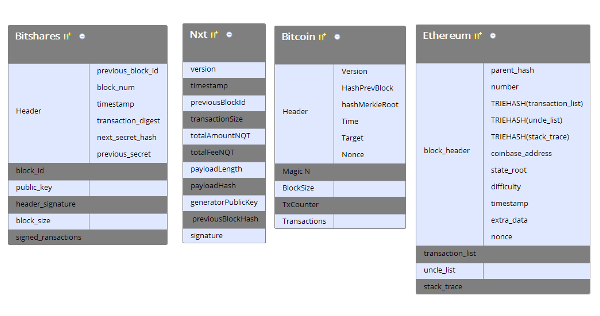

# Block Structure in cryptocurrencies

In this article I'm going to provide a brief review of block structure in cryptocurrencies.

## Introduction

A variety of cryptocurrencies, starting with [Bitcoin](https://bitcoin.org/bitcoin.pdf) are based on *blockchain* structure.
In *blockchain* multiple transactions modifying cryptocurrency state are grouped into blocks generated according *consensus protocol*.
Blocks are ordered by linking to previous block thus the term *blockchain*. As blocks are chained, the work to change the block would include redoing all the blocks after it.  
So *block* should contain at least *transactional data* modifying current state, *consensus data* approving the right to generate a block and a link to previous block.

## Examples

Block structures of different cryptocurrencies are represented below.

To fight with the *blockchain boat* problem, and also in order to provide support for light clients, most of blockchains distinguish block *header* from the block payload to be able to  prune old transactions from the blockchain keeping it secure.
The header should be enough to verify consensus data and choose the chain with the best *score* (*cumulative difficulty* in Bitcoin jargon) determined by corresponding consensus algorithm.
Besides of consensus data and a link to previous block header should contain some *digest* of transactions to make transactional data immutable.
Root hash of authenticated data structure build on top of transactions is usually used for this purposes allowing to prove existence (or non-existence) of a specified transaction in a block. 
Once block structure may change during cryptocurrency development, it's usually good idea to have block *version* in header.
Blocks of proof-of-work currencies are immutable by design, because it's required to solve computational puzzle one more time to change any data in a block, but proof-of-stake currencies ([Nxt](https://nxt.org/) and [Bitshares](https://bitshares.org/) on the picture above) require a signature to make block header (or the entire block) immutable. 

Depending on the purpose additional data may be added to block header. For example, [Ethereum](https://www.ethereum.org/) adds root hash of the current *state* to block header allowing to download only block headers and current state for a new node thus significantly reducing bootstrapping time.
Note, that this additional data may be used as a part of consensus algorithm, e.g. [Rollerchain](http://arxiv.org/pdf/1603.07926v3.pdf) proposes to use this state root hash to force miners to keep full node.

## A Common Structure

In this section I'll try to propose common structure of cryptocurrency block.
Note, that particular design of a cryptocurrency may be different for some use cases, e.g. Nxt do not have a block header, which may be unnecessary complication when you don't care about disk space. 

**HEADER**  
  *  *version* - may be useful in case of actively developing blockchain to be able to change some parts of protocol  
  *  *previous block id* - link to previous block is required to make blockchain from blocks  
  *  *payload digest(s)* - all data, that is not in this header, should be verifiable with this field(s). In the simplest case, it's just root hash of merkle tree build on top of block transactions.  It may be a good idea to add root hash of current state  in order to make light node bootstrapping process trustless. 
  *  *consensus data* -this data may differs from one consensus algorithm to another, but it should be possible to verify block score with this data and it should clue all the header together. Consensus data usually consist of:    
     *score* - block score (difficulty) is required to verify, that producer had a right to generate a new block and to select best blockchain between different forks.  
     *timestamp* - timestamp is required to recalculate current score to fix mean time between blocks.  
     *clue* - some data, that clue all the header together and verifies the right to generate block. For PoW currencies it is *nonce* field, for PoS it is public key and signature pair.  
  *  *additional data* - it may be useful to add some additional data to simplify some blockchain manipulations. For example, some pre-computed data like block height may be added here (like in Ethereum) although it could be computed from previous blocks.  
**BODY**  
  *  *transactions* - the only required field in block body is sequence of state modificators.  
  *  *additional data* - depending on the blockchain purposes, there may be a lot of additional data in body. Note, that if it should be immutable, it's requred to add it's digest to block header.

Of course, it is a very abstract block structure and any additional data may be added to the header or the body (keeping the header significantly smaller than the body) but most of cryptocurrencies follows it in some form.

If you know better block design - please provide some feedback in comments!
  
